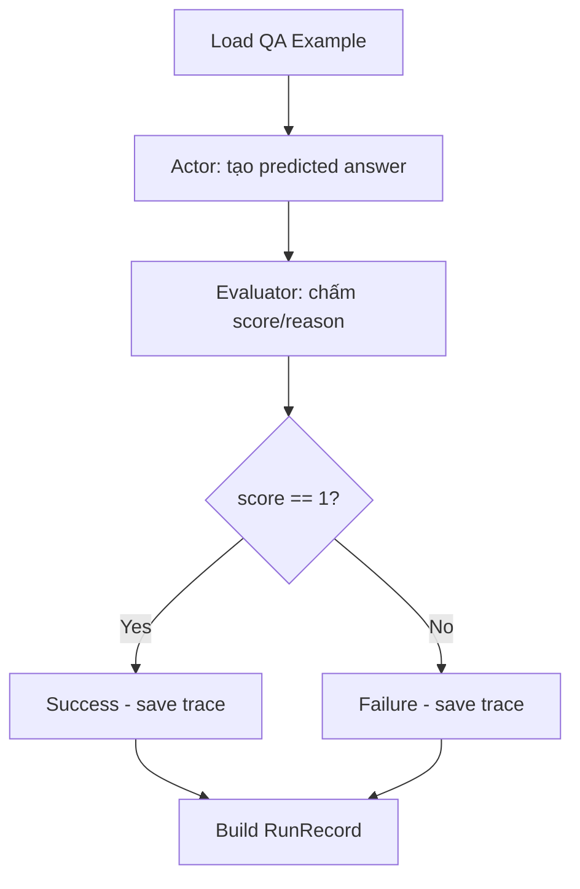

# Architecture Overview - Lab Reflexion Agent

## 1) Tổng quan bài lab

Lab này hướng đến xây dựng và đánh giá 2 chiến lược tác nhân hỏi đáp đa bước trên HotpotQA:

- ReAct: trả lời trong một lần suy luận/chấm điểm, không có vòng học từ lỗi.
- Reflexion (bạn có thể gõ nhầm Reflextion): tác nhân tự phản chiếu sau mỗi lần sai để cải thiện lần sau.

Mục tiêu benchmark:

- Chạy trên tập dữ liệu thực `data/hotpot_100.json`.
- So sánh chất lượng và chi phí giữa ReAct và Reflexion.
- Xuất báo cáo chuẩn để autograde: `report.json` và `report.md`.

## 2) Kiến trúc thành phần

Hệ thống gồm các lớp chính:

- Dataset + Schema:
  - Định nghĩa cấu trúc dữ liệu HotpotQA (`QAExample`, context, supporting facts).
  - Định nghĩa trace theo attempt và report schema.
- Runtime LLM:
  - Gọi OpenAI cho 3 vai trò: Actor, Evaluator, Reflector.
  - Thu thập usage token + latency theo từng call.
- Agent layer:
  - `ReActAgent`: 1 attempt.
  - `ReflexionAgent`: nhiều attempt, dùng reflection memory.
- Reporting layer:
  - Tổng hợp EM, số lần thử trung bình, token trung bình, latency trung bình.
  - Phân tích failure mode + xuất Markdown/JSON.

## 3) Định nghĩa ReAct và Reflexion

### ReAct

ReAct kết hợp suy luận và hành động trong một lượt. Trong bài lab này:

1. Actor tạo câu trả lời dựa trên context.
2. Evaluator chấm đúng/sai.
3. Nếu sai, lượt ReAct kết thúc (không có sửa lỗi lần 2).

### Reflexion

Reflexion bổ sung vòng học từ lỗi:

1. Actor tạo câu trả lời.
2. Evaluator chấm điểm và nếu sai thì trả về lý do.
3. Reflector phân tích lỗi, rút ra lesson, đề xuất next strategy.
4. Reflection memory được đưa vào attempt tiếp theo.
5. Lặp đến khi đúng hoặc hết `max_attempts`.

## 4) So sánh ReAct vs Reflexion

| Tiêu chí | ReAct | Reflexion |
|---|---|---|
| Số attempt | Thường 1 | 1..N (`max_attempts`) |
| Có memory sửa lỗi | Không | Có (`reflection_memory`) |
| Chất lượng (EM) | Ổn định, có thể thấp hơn ở bài multi-hop khó | Thường cao hơn nếu evaluator + reflector tốt |
| Token/latency | Thấp hơn | Cao hơn do nhiều vòng |
| Độ phức tạp hệ thống | Đơn giản | Cao hơn (thêm Reflector + memory) |
| Rủi ro | Sai thì dừng luôn | Có thể overfit reflection hoặc lãng phí vòng lặp |

## 5) Luồng xử lý ReAct



## 6) Luồng xử lý Reflexion

```mermaid
flowchart TD
    A[Load QA Example] --> B[Init reflection_memory = []]
    B --> C[Attempt i]
    C --> D[Actor: tạo predicted answer]
    D --> E[Evaluator: score/reason]
    E --> F{score == 1?}
    F -- Yes --> G[Save trace and stop]
    F -- No --> H{i < max_attempts?}
    H -- No --> I[Stop with failure]
    H -- Yes --> J[Reflector: failure_reason, lesson, next_strategy]
    J --> K[Append next_strategy vào reflection_memory]
    K --> L[Save trace + reflection]
    L --> C
    G --> M[Build RunRecord]
    I --> M
```

## 7) Ý nghĩa các chỉ số benchmark

- EM: tỷ lệ exact match với gold answer sau normalize.
- Avg attempts: số lần thử trung bình mỗi câu hỏi.
- Avg tokens per question: chi phí token trung bình mỗi câu.
- Avg latency: độ trễ trung bình (ms) mỗi câu.

Reflexion thường đánh đổi chi phí (token/latency) để đổi lấy cải thiện EM, đặc biệt với câu hỏi multi-hop.

## 8) Khuyến nghị vận hành

- Đặt timeout/retry cho call LLM để tránh cảm giác treo.
- In progress trong benchmark (ví dụ mỗi 10 câu).
- Bắt đầu với `max_attempts=2` hoặc `3` để cân bằng chất lượng và chi phí.
- Tách riêng lỗi evaluator và lỗi actor khi phân tích failure mode.
